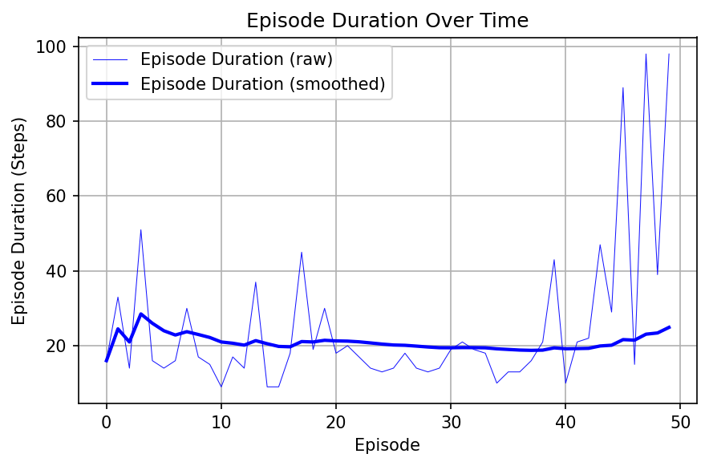
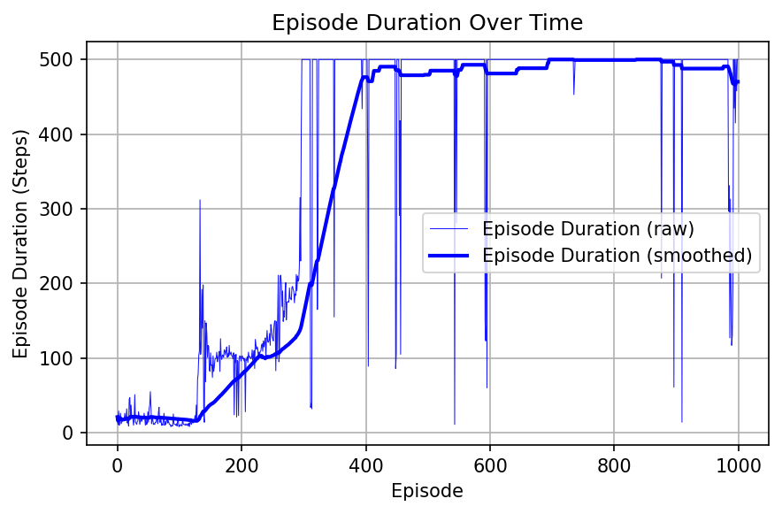

# Assignment 2 report
## Problem 1
Implement DQN on a Cart-pole problem. The code can be found on [DQN Implementation notebook](https://pytorch.org/tutorials/intermediate/reinforcement_q_learning.html)
## Prob 1a
Build the tool chain. You can either use the tool chain recommended in the class lecture, i.e., Anaconda + Pytorch +Pycharm, or use your own favorite tool chain. The goal is to implement the given code and obtain a duration-episode plot similar to below.

The code implementation is in `dqn_cartpole.py`. The implementation is using OpenAI's gymnasium, pytorch. To setup the environment with conda. Create a new conda environment. Install pytorch, gymnasium and other necessary packages.
The plot shows the duration in steps for each episode. In CartPole problem, the duration is equal to reward.

## Prob 1b 
Change the episode number from 50 to `1000`. Plot the duration-episode plot.
### Plot Episode vs Duration
The plot shows the duration for each episode.

### Observations and Interpretation

## Prob 1c
Change the value function discount factor (gamma) from 0.99 to `0.89`. Plot the duration-episode plot.
### Plot Episode vs Duration
The plot shows the duration for each episode.

### Observations and Interpretation

## Prob 1d
Change the mini-batch size of experience pool to `1500`. Plot the duration-episode plot.
### Plot Episode vs Duration
The plot shows the duration for each episode.

### Observations and Interpretation

## Prob 1e
Change the Learning rate(lr) to `1e-2`. Plot the duration-episode plot.
### Plot Episode vs Duration
The plot shows the duration for each episode.

### Observations and Interpretation

## Cliff walk example
Grid in which some of the blocks are considered as cliff. The goal is to reach the goal while avoiding the cliff.
Write SARSA and Q-Learning code to compare the episodic sum of rewards.

## Prob 2a
Try changing the gamma $\gamma$ = 0.01, 0.1, 0.5, 0.99, 1 and plot the episodic sum of rewards.
### Plot Episode vs Duration

### Observations and Interpretation

## Prob 2b
Under what circumstances Q-learning and SARSA will have the same episodic sum of rewards.

