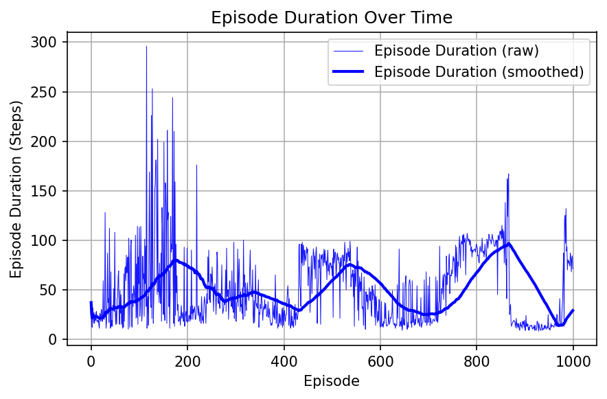
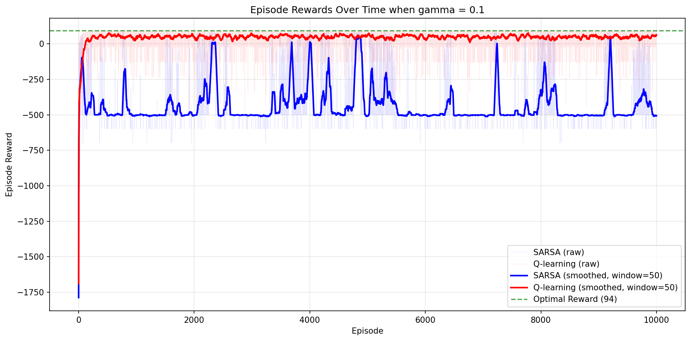

# MultiAgent systems - Assignment 2 report
Author: Supreeth Suresh

Date: 10/8/2025

Github: https://github.com/supreethms1809/multiagent.git

## Problem 1
Implement DQN on a Cart-pole problem. The code can be found on [DQN Implementation notebook](https://pytorch.org/tutorials/intermediate/reinforcement_q_learning.html)
## Prob 1a
**Q:** Build the tool chain. You can either use the tool chain recommended in the class lecture, i.e., Anaconda + Pytorch +Pycharm, or use your own favorite tool chain. 
The goal is to implement the given code and obtain a duration-episode plot similar to below.

The code implementation is in `dqn_cartpole.py`. The implementation is using OpenAI's gymnasium, pytorch. 
To setup the environment with conda. Create a new conda environment. Install pytorch, gymnasium and other necessary packages.

## Code Changes from the original example code
There are a few modifications done to the original DQN implementation.
1. Policy update frequency added:
    In the original implementation, the target policy updates happens for every step. The modified implementation has a new parameter added `target_update_freq` which helps us to control the frequency of target policy update. The example code implements soft update (which is target policy update every step or every N steps (N is a small number)). N=5, shows a moderate convergence. But N=50 shows highly unstable training and difficulty in convergence.
    **For our experiments, N is set to 1.**
2. Better modularization:
    The original code implement everything in the main function. The modified implementation uses a new class called `DQNagent` to make the code more modular.
3. Training arguments as command line options:
    Compared to the original implementation, the modified implementation accepts all the tunable parameters as command line options.
4. Smoothing in plotting:
    A window smoothing functionality is added for better comparision

## Code running instructions
You can use the following usage to run the code or you can also run the code using the jupyter notebook attached.
### Problem 1
```Python
python dqn_cartpole.py --help
usage: dqn_cartpole.py [-h] [--problem {1a,1b,1c,1d,1e}] [--env_name ENV_NAME] [--render] [--render_mode RENDER_MODE] [--render_time RENDER_TIME] [--max_steps MAX_STEPS] [--batch_size BATCH_SIZE]
                       [--gamma GAMMA] [--epsilon_start EPSILON_START] [--epsilon_end EPSILON_END] [--epsilon_decay EPSILON_DECAY] [--tau TAU] [--lr LR] [--memory_capacity MEMORY_CAPACITY]
                       [--max_episodes MAX_EPISODES]
#eg: python dqn_cartpole.py --problem 1a
```
### Problem 2
```Python
python cliff_qlearn_sarsa.py --help
usage: cliff_qlearn_sarsa.py [-h] [--grid_size GRID_SIZE] [--goal_states GOAL_STATES] [--start_state START_STATE] [--cliff_states CLIFF_STATES] [--cliff_reward CLIFF_REWARD] [--step_reward STEP_REWARD]
                             [--goal_reward GOAL_REWARD] [--gamma GAMMA] [--epsilon EPSILON] [--max_episodes MAX_EPISODES] [--max_steps_per_episode MAX_STEPS_PER_EPISODE]
                             [--alpha_qlearning ALPHA_QLEARNING] [--alpha_sarsa ALPHA_SARSA] [--run_all]
#eg: python cliff_qlearn_sarsa.py --run_all
```

### Files
- `dqn_cartpole.py` - Code implementation of DQN for CartPole problem
- `cliff_qlearn_sarsa.py` - Code implementation of cliff walk example (with Q learning and SARSA)
- `assignment2report.pdf` - Assignment 2 report
- `coderunlog.pdf` - pdf version of the run log

**Optional**
- `coderunlog.ipynb` - Jupyter notebook that shows run log and the corresponding plots
- `assignment2report.md` - Assignment 2 report in markdown format
- `images\` - directory that contains plots from running the code

### Results
The plot shows the duration in steps for each episode. 


### Observations and Interpretations
The plot shows the successful implementation of DQN based on the example code. Tool chain used: Anaconda + pytorch + gymnasium + matplotlib.
The plot shows the agent is not able to balance the pole for longer duration of time.
**In CartPole problem, the duration is equal to reward.** 
Therefore if the duration is better, then the pole is balanced for a longer time.
50 episodes is insufficient for agent to learn.

## Prob 1b 
**Q:** Change the episode number from 50 to `1000`. Plot the duration-episode plot.
### Plot Episode vs Duration
The plot shows the duration for each episode.


### Observations and Interpretation
For this problem, we change the number of episodes from 50 to 1000. Other parameters used for training includes
- **max_episodes = 1000**
- batch_size = 128
- gamma = 0.99
- epsilon_start = 0.9
- epsilon_end = 0.01
- epsilon_decay = 2500
- tau = 0.005
- target_update_freq = 1
- lr =3e-4
- memory_capacity = 10000

The plot show good learning after increasing the episodes. Since we set the max steps to be 500, the agent is able to balance the pole for max steps. Although there is a bit of variance during the early episodes, agent is more stable after a few hundred episodes. The smoothened curve shows a good learning progress.

## Prob 1c
**Q:** Change the value function discount factor (gamma) from 0.99 to `0.89`. Plot the duration-episode plot.
### Plot Episode vs Duration
The plot shows the duration for each episode.


### Observations and Interpretation
For this problem, we change the discount factor $\gamma$ from 0.99 to 0.89. Other parameters used for training includes
- max_episodes = 1000
- batch_size = 128
- **gamma = 0.89**
- epsilon_start = 0.9
- epsilon_end = 0.01
- epsilon_decay = 2500
- tau = 0.005
- target_update_freq = 1
- lr =3e-4
- memory_capacity = 10000

$\gamma$ is the discount factor. A lower $\gamma$ means agent is more focused on the immediate reward. Lowering the value from 0.99 to 0.89, shows a faster initial learning but a lower final performance. The smoothed learning curve shows a good learning progress at the begining but starts to trail off towards the later episodes. The agent is not able to reach convergence even after 1000 episodes. This shows the importance having a good value for $\gamma$

## Prob 1d
**Q:** Change the mini-batch size of experience pool to `1500`. Plot the duration-episode plot.
### Plot Episode vs Duration
The plot shows the duration for each episode.


### Observations and Interpretation
For this problem, we change the mini-batch size from 128 to 1500. Other parameters used for training includes
- max_episodes = 1000
- **batch_size = 1500**
- gamma = 0.99
- epsilon_start = 0.9
- epsilon_end = 0.01
- epsilon_decay = 2500
- tau = 0.005
- target_update_freq = 1
- lr =3e-4
- memory_capacity = 10000

Changing the mini-batch size from 128 to 1500. There is a increase in number of samples used for training. The curve shows a low variance and smoother learning curve. Low variance shows a good and stable gradient updates. The plot shows a slower convergence compared to batch size 128. Question is should we drastically increase the batch size? It depends on the hardware available to you. if you want a slower convergence smoother curve or faster convergence but not so smooth curve.

## Prob 1e
**Q:** Change the Learning rate(lr) to `1e-2`. Plot the duration-episode plot.
### Plot Episode vs Duration
The plot shows the duration for each episode.


### Observations and Interpretation
For this problem, we change the learning rate from 3e-4 to 1e-2. Other parameters used for training includes
- max_episodes = 1000
- batch_size = 128
- gamma = 0.99
- epsilon_start = 0.9
- epsilon_end = 0.01
- epsilon_decay = 2500
- tau = 0.005
- target_update_freq = 1
- **lr = 1e-2**
- memory_capacity = 10000

Increasing the learning rate from 3e-4 to 1e-2, the training finished very quickly compared to the other cases. But the plot shows no convergence. Looking at the earlier episodes from the plot, the agent tried to learn very quickly with very high variance but the performance drops significantly after that. Considering the update equation (lr * gradient), the code uses a norm clipping of (-100, 100). That means the gradients are very large even with clipping and if we have a very high learning rate, the weight updates are moved by a large amount. Thus causing instability in learning and convergence.

## Cliff walk example
Grid in which some of the blocks are considered as cliff. The goal is to reach the goal while avoiding the cliff.
Write SARSA and Q-Learning code to compare the episodic sum of rewards.
### Notes from the book
Cliff Walking This gridworld example compares Sarsa and Q-learning, highlighting the difference between on-policy (Sarsa) and offpolicy (Q-learning) methods. Consider the gridworld shown in the upper part of Figure 6.13. This is a standard undiscounted, episodic task, with start and goal states, and the usual actions causing movement up, down, right, and left. Reward is −1 on all transitions except those into the the region marked “The Cliff.” Stepping into this region incurs a reward of −100 and sends the agent instantly back to the start. The lower part of the figure shows the performance of the Sarsa and Q-learning methods with ε-greedy action selection, ε = 0.1. After an initial transient, Q-learning learns values for the optimal policy, that which travels right along the edge of the cliff. Unfortunately, this results in its occasionally falling off the cliff because of the ε-greedy action selection. Sarsa, on the other hand, takes the action selection into account and learns the longer but safer path through the upper part of the grid. Although Qlearning actually learns the values of the optimal policy, its on-line performance is worse than that of Sarsa, which learns the roundabout policy. Of course, if ε were gradually reduced, then both methods would asymptotically converge to the optimal policy.

## Prob 2a
**Q:** Try changing the gamma $\gamma = 0.01, 0.1, 0.5, 0.99$, 1 and plot the episodic sum of rewards.
### Plot Episode vs rewards and comments
The cliff walk problem is implemented in cliff_qlearn_sarsa.py. The implementation runs both Q-learning(off-policy) and SARSA(on-policy) algorithm. For Q learning, we use epsilon greedy policy and greedy policy. For SARSA, we use epsilon greedy policy.

The plot shows the episode reward for each episode and the GridWorld with final learned path. In the first experiment, we keep all the parameteres constant and vary the value of $\gamma$ = {0.01, 0.1, 0.5, 0.99, 1}.
First lets define $\gamma$ before analyzing the plots. $\gamma$ is the discount factor. $\gamma$ determines if the agents focuses on immediate rewards or the future rewards. lower value of gamma means the agent favours the immediate rewards and higher value of gamma means the agent favours future rewards. $\gamma = 1$, all rewards are equally important.

When $\gamma = 0.01$, the agent only focuses on the immediate rewards. The plot shows there is no convergence. The agent never reaches the goal state for both Q-learning and SARSA. Both Q-learning and SARSA, shows a very high variance. The total rewards for each episode are always in the negetive. The performance with SARSA is much worse than Q-learning becasuse of the exploration (on-policy epsilon greedy policy). The GridEnv plot shows the agent never reaches the goal state.

{ width=600px height=400px }
{ width=600px height=200px }

When $\gamma = 0.1$, the agent still only focuses mostly on the immediate rewards. The plot shows there is no convergence for SARSA but shows convergence (not consistent) for Q-learning. Both Q-learning and SARSA, shows a very high variance. The total rewards for each episode are mostly in the negetive. The performance with SARSA is much worse than Q-learning again becasuse of the exploration (on-policy epsilon greedy policy). The GridEnv plot shows the agent never reaches the goal state for SARSA.

{ width=600px height=400px }
{ width=600px height=200px }

When $\gamma = 0.5$, the agent moderately favors future rewards. For a very small example like cliff walk, the agent is able to reach the goal state for both Q-learning and SARSA. While Q-learning took the optimal path, SARSA took a much safer but longer path further away from the cliff to reach the goal. The same can be inferred from the reward plot. The Q values of SARSA always runs below that of Q-learning.

{ width=600px height=400px }
{ width=600px height=200px }

When $\gamma = 0.99$, the agent favours future long term rewards. So, it is better at long term planning. The learning plot shows a good, smooth, and fast learning curve. The gridworld plot shows that the agent is able to reach the goal state with both Q-learning and SARSA. The paths differ for Q-learning and SARSA. Q-learning found the optimal path while avoiding the cliff. SARSA on the other hand took a suboptimal safer path.

{ width=600px height=400px }
{ width=600px height=200px }

When $\gamma = 1$, the agent gives equal importance to all the rewards. The learning plot shows a good, smooth, and fast learning curve. The gridworld plot shows that the agent is able to reach the goal state with both Q-learning and SARSA. The paths differ for Q-learning and SARSA. Q-learning found the optimal path while avoiding the cliff. SARSA on the other hand took a suboptimal safer path. The plot is very similar to $\gamma=0.99$, the only difference is the Q value with SARSA is slightly closer to the optimal.

{ width=600px height=400px }
{ width=600px height=200px }

In conclusion, for practical example having $\gamma$ between 0.9 to 0.99 should be a good start. So for the next experiment, we set the gamma value to 0.99.

## Prob 2b
**Q:**Under what circumstances Q-learning and SARSA will have the same episodic sum of rewards.
lets keep the gamma $\gamma=0.99$ constant and vary the epsilon $\epsilon = 0.01, 0.1, 0.5, 0.99$
epsilon value in the epsilon greedy policy defines the amount of exploration. epsilon helps explore alternate actions. Lower value of epsilon means the agent mostly relies on the max values of Q to determine the action. A high value of epsilon means the agents agressively explore alternate actions. This is evident from the plots below. 

When $\gamma=0.99$ and $\epsilon=0.01$, both Q-learning and SARSA converge to the optimal solution. A low value of $\epsilon$, both Q-learning and SARSA will have a very similar episodic sum of rewards. When we have low epsilon value, the agent almost always chooses the greedy action. When epsilon is zero, there is no exploration. So Q-learning and SARSA will have the same episodic sum of rewards.

### Plot Episode vs Duration
{ width=600px height=400px }
{ width=600px height=200px }

{ width=600px height=400px }
{ width=600px height=200px }

As we keep increasing the value of epsilon, the agent explores more and more. While this is bad for both Q-learning and SARSA, it affects SARSA more (on-policy e-greedy policy). This is evident from the graph. You see a very high variance. When epsilon is 0.99, Both Q-learning and SARSA, completely fails to converge. Agent is always stuck exploring.

{ width=600px height=400px }
{ width=600px height=200px }

{ width=600px height=400px }
{ width=600px height=200px }
