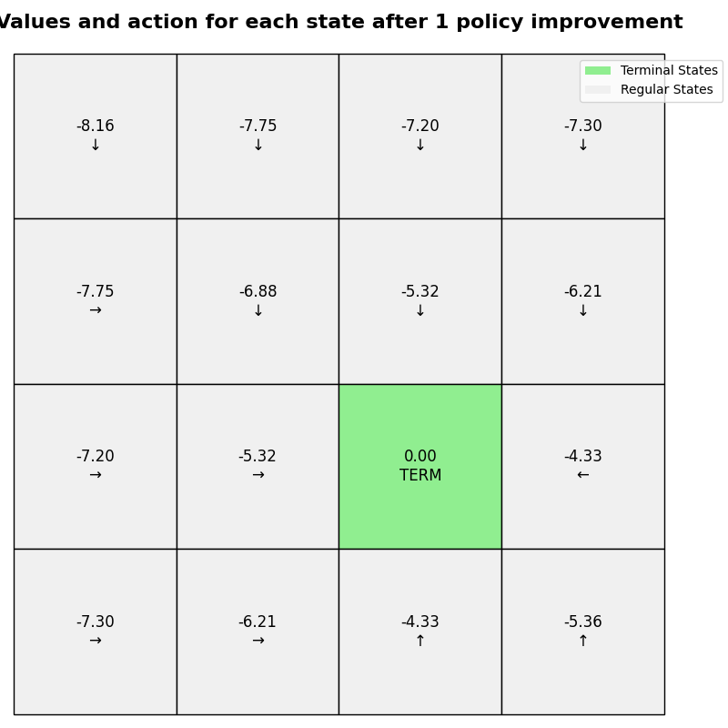
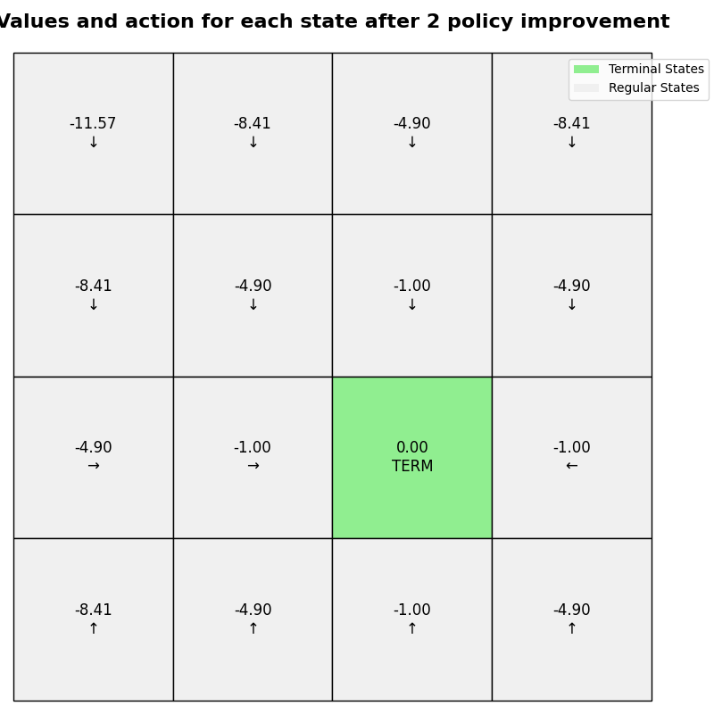
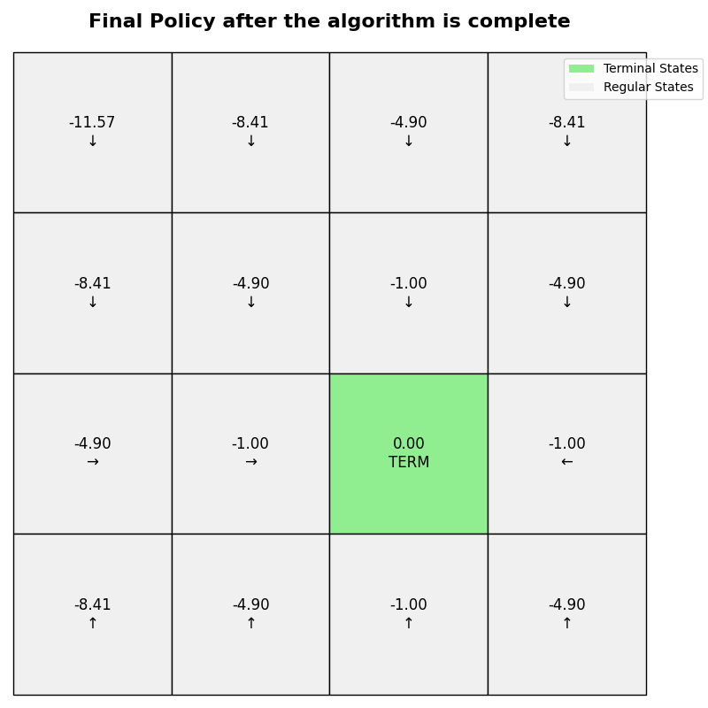

# Assignment 1 - Policy iteration and Value iteration for grid example
Author: Supreeth Suresh

Date: 9/17/2025

Course: AI for Multiagent system

## How to run the code
The code is located on Github [https://github.com/supreethms1809/multiagent.git](https://github.com/supreethms1809/multiagent.git).

```Python
python assignment1_main.py [-h] [--task {policy_iteration,value_iteration}] \\
    [--gamma GAMMA] [--epsilon EPSILON] [--max_iterations MAX_ITERATIONS] \\
    [--grid_size grid_size] [--stepReward STEPREWARD] [--goalReward GOALREWARD] \\
    [--valueFunctionInit {V,Q}] [--randomValueFunctionInit] [--randomPolicyInit] \\
    [--problem {1,2,3,4}] [--plotTable] [--goalStates GOALSTATES]

    options:
    -h, --help            show this help message and exit
    --task {policy_iteration,value_iteration}
    --gamma GAMMA                           Gamma for the value iteration
    --epsilon EPSILON                       Epsilon for the value iteration
    --max_iterations MAX_ITERATIONS         Maximum number of iterations for the value iteration and policy iteration
    --grid_size grid_size                   Size of the grid N
    --stepReward STEPREWARD                 Step reward
    --goalReward GOALREWARD                 Goal reward
    --valueFunctionInit {V,Q}               Type of value function used V or Q
    --randomValueFunctionInit               Initialize the value function with random values
    --randomPolicyInit                      Initialize the policy with random values
    --problem {1,2,3,4}                     Problem number
    --plotTable                             Plot the value function and policy
    --goalStates GOALSTATES                   Goal states list. Format list of tuples [(x, y), (x, y), ...]
```
The configurations for the four problems given in the assignment is hardcoded in the source code for convinience.
Alternatively, you can also pass the configurations as the command line options. The usage is shown above.

To run problem 1 use
```Python
python assignment1_main.py --problem 1

# Problem 1 sets the following options
#config.stepReward = -1
#config.goalReward = 0
#config.gamma = 0.9
#config.epsilon = 1e-6
#config.max_iterations = 150
#config.grid_size = 4
#config.valueFunctionInit = "V"
#config.randomValueFunctionInit = False
#config.randomPolicyInit = False
#config.task = "policy_iteration"
#config.plotTable = True
#config.goalStates = [(0, 0), (3, 3)]
```

To run problem 2,3,4
```Python
python assignment1_main.py --problem 2
python assignment1_main.py --problem 3
python assignment1_main.py --problem 4
```

## Problem description
- Grid map problem, one agent moves on the grid map. 
- The terminal states are (0,0) --> 0 and (3,3) --> 15.
- Reward for going to the terminal state 0.

## Problem 1
- Policy is uniform distribution policy
- every step generates reward -1
- gamma $\gamma=0.9$
- Evaluate the policy iteratively
- Plot the value of each state after the policy evaluation is complete(One plot)
- Tips: 1. run more than 150 iterations. 2. set the convergence threshold less than 1e-6

Run `python assignment1_main.py --problem 1`
### Value and action of each state after the policy evaluation is complete 


## Problem 2
Run `python assignment1_main.py --problem 2`

### Value and action of each state after the policy evaluation is complete


## Problem 3
Run `python assignment1_main.py --problem 3`
### Value and action of each state after the 1st policy improvement



### Value and action of each state after the 2nd policy improvement



### Value and action of each state after the 3rd policy improvement


## Problem 4
Run `python assignment1_main.py --problem 4`
### Value after the algorithm is complete


### Policy after the algorithm is complete 


