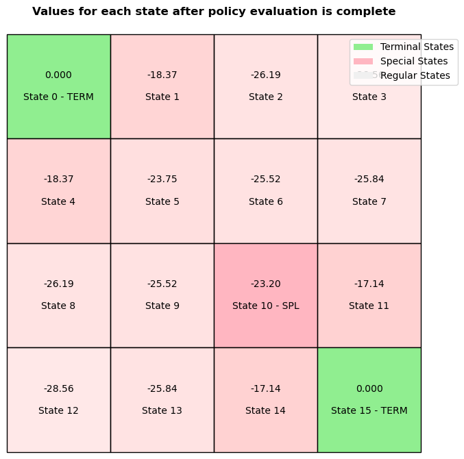
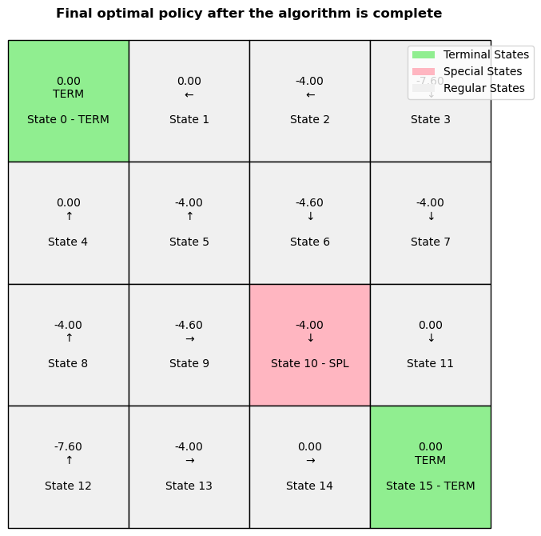

# Assignment 1 - Policy iteration and Value iteration for grid example
Author: Supreeth Suresh

Date: 9/17/2025

Course: AI for Multiagent system

## How to run the code
The code is located on Github [https://github.com/supreethms1809/multiagent.git](https://github.com/supreethms1809/multiagent.git).

```Python
python assignment1_main.py [-h] [--task {policy_iteration,value_iteration}] \\
    [--gamma GAMMA] [--epsilon EPSILON] [--max_iterations MAX_ITERATIONS] \\
    [--grid_size grid_size] [--stepReward STEPREWARD] [--goalReward GOALREWARD] \\
    [--valueFunctionInit {V,Q}] [--randomValueFunctionInit] [--uniformPolicyInit] \\
    [--problem {1,2,3,4}] [--plotTable] [--goalStates GOALSTATES] [--splStates SPECIALSTATES] [--splReward SPLREWARD]

    options:
    -h, --help            show this help message and exit
    --task {policy_iteration,value_iteration}
    --gamma GAMMA                           Gamma for the value iteration
    --epsilon EPSILON                       Epsilon for the value iteration
    --max_iterations MAX_ITERATIONS         Maximum number of iterations for the value iteration and policy iteration
    --grid_size grid_size                   Size of the grid N
    --stepReward STEPREWARD                 Step reward
    --goalReward GOALREWARD                 Goal reward
    --valueFunctionInit {V,Q}               Type of value function used V or Q
    --randomValueFunctionInit               Initialize the value function with random values
    --uniformPolicyInit                     Initialize the policy with uniform distribution
    --problem {1,2,3,4}                     Problem number
    --plotTable                             Plot the value function and policy
    --goalStates GOALSTATES                 Goal states list. Format list of tuples [(x, y), (x, y), ...]
    --splStates SPECIALSTATES               Spl states list. Format list of tuples [(x, y), (x, y), ...]
    --splReward SPLREWARD                   Special state reward 
```
The configurations for the four problems given in the assignment is hardcoded in the source code for convinience.
Alternatively, you can also pass the configurations as the command line options. The usage is shown above.

To run problem 1 use
```Python
python assignment1_main.py --problem 1

# Problem 1 sets the following options
# config.stepReward = -1
# config.goalReward = 0
# config.gamma = 0.9
# config.epsilon = 1e-6
# config.max_iterations = 150
# config.grid_size = 4
# config.valueFunctionInit = "V"
# config.randomValueFunctionInit = False
# config.uniformPolicyInit = True
# config.task = "policy_iteration"
# config.plotTable = True
# config.goalStates = [(0, 0), (3, 3)]
# config.splStates = None
# config.splReward = None
```

To run problem 2,3,4
```Python
python assignment1_main.py --problem 2
python assignment1_main.py --problem 3
python assignment1_main.py --problem 4
```

## Problem description
- Grid map problem, one agent moves on the grid map. 
- The terminal states are (0,0) --> 0 and (3,3) --> 15.
- Reward for going to the terminal state 0.

## Problem 1 - Policy Iteration
- Policy iteration
- Policy is uniform distribution policy
- every step generates reward -1
- Goal reward 0
- gamma $\gamma=0.9$
- Goal state (0,0) and (3,3)
- Evaluate the policy iteratively
- Plot the value of each state after the policy evaluation is complete(One plot)
- Tips: 1. run more than 150 iterations. 2. set the convergence threshold less than 1e-6

Policy iteration consists of two parts. First is the policy evaluation and the policy improvement.
In this phase, we calculate the value function using the Bellman expectation equation under the current policy

$V^\pi(s) = \sum_{a} \pi(a|s) \sum_{s'} P(s'|s,a)\big[ R(s,a,s') + \gamma V^\pi(s') \big]$

We run this update for all states until the values converge (i.e., they stop changing between successive iterations) or until a maximum number of iterations is reached. During this process, the policy remains fixed.

Once we have an updated value function, we improve the policy by making it greedy with respect to the current value estimates:

$ \pi'(s) = \arg\max_a \sum_{s'} P(s'|s,a)\big[ R(s,a,s') + \gamma V^\pi(s') \big] $

If the policy changes, we repeat the evaluation and improvement steps. If the policy remains unchanged (i.e., stable), then we have reached convergence.

Run `python assignment1_main.py --problem 1`
```Python
# Problem 1 sets the following options
# config.stepReward = -1
# config.goalReward = 0
# config.gamma = 0.9
# config.epsilon = 1e-6
# config.max_iterations = 200
# config.grid_size = 4
# config.valueFunctionInit = "V"
# config.randomValueFunctionInit = True
# config.uniformPolicyInit = True
# config.task = "policy_iteration"
# config.plotTable = True
# config.goalStates = [(0, 0), (3, 3)]
# config.splStates = None
# config.splReward = None
```
Running problem 1
```bash
INFO:__main__:Performing calculations for Prob 1: policy_iteration with V value function and uniform distribution for policy initialization
INFO:__main__:Using V value function with random initialization
INFO:__main__:Using uniform policy initialization
INFO:__main__:Starting policy iteration with 200 max iterations
INFO:__main__:Value function converged after 62 evaluation iterations
INFO:__main__:Plotting value function
INFO:__main__:Value function converged after 4 evaluation iterations
INFO:__main__:Value function converged after 1 evaluation iterations
INFO:__main__:Policy converged after 3 iterations
INFO:__main__:Policy iteration converged successfully
```

### Value and action of each state after the policy evaluation is complete 


## Problem 2 - Policy Iteration
- Policy iteration
- Policy is uniform distribution policy
- every step generates reward -4
- Goal state reward 0
- gamma $\gamma=0.9$
- Special state reward -1
- Special state (2,2) --> state 10
- Goal state (0,0) and (3,3)
- Evaluate the policy iteratively
- Plot the value of each state after the policy evaluation is complete(One plot)


Run `python assignment1_main.py --problem 2`
```Python
# Problem 2 sets the following options
# config.stepReward = -4
# config.goalReward = 0
# config.gamma = 0.9
# config.epsilon = 1e-6
# config.max_iterations = 200
# config.grid_size = 4
# config.valueFunctionInit = "V"
# config.randomValueFunctionInit = True
# config.uniformPolicyInit = True
# config.task = "policy_iteration"
# config.plotTable = True
# config.goalStates = [(0, 0), (3, 3)]
# config.splStates = [(2,2)]
# config.splReward = -1
```
Running problem 2
```bash
INFO:__main__:Performing calculations for Prob 2: policy_iteration with V value function and uniform distribution for policy initialization
INFO:__main__:Using V value function with random initialization
INFO:__main__:Using uniform policy initialization
INFO:__main__:Starting policy iteration with 200 max iterations
INFO:__main__:Value function converged after 62 evaluation iterations
INFO:__main__:Plotting value function
INFO:__main__:Value function converged after 4 evaluation iterations
INFO:__main__:Value function converged after 1 evaluation iterations
INFO:__main__:Policy converged after 3 iterations
INFO:__main__:Policy iteration converged successfully
```


### Value and action of each state after the policy evaluation is complete



## Problem 3 - Policy Iteration
- Policy iteration
- Policy is uniform distribution policy
- every step generates reward -4
- Goal state reward 0
- gamma $\gamma=0.9$
- Special state reward -1
- Special state (2,2) --> state 10
- Goal state (0,0) and (3,3)
- Evaluate the policy iteratively


Run `python assignment1_main.py --problem 3`
```Python
# Problem 3 sets the following options
# config.stepReward = -4
# config.goalReward = 0
# config.gamma = 0.9
# config.epsilon = 1e-6
# config.max_iterations = 200
# config.grid_size = 4
# config.valueFunctionInit = "V"
# config.randomValueFunctionInit = True
# config.uniformPolicyInit = True
# config.task = "policy_iteration"
# config.plotTable = True
# config.goalStates = [(0, 0), (3, 3)]
# config.splStates = [(2,2)]
# config.splReward = -1
```
Running problem 3
```bash
INFO:__main__:Performing calculations for Prob 3: policy_iteration with V value function and uniform distribution for policy initialization
INFO:__main__:Using V value function with random initialization
INFO:__main__:Using uniform policy initialization
INFO:__main__:Starting policy iteration with 200 max iterations
INFO:__main__:Value function converged after 62 evaluation iterations
INFO:__main__:Plotting optimal policy with values and actions
INFO:__main__:Value function converged after 4 evaluation iterations
INFO:__main__:Plotting optimal policy with values and actions
INFO:__main__:Value function converged after 1 evaluation iterations
INFO:__main__:Plotting optimal policy with values and actions
INFO:__main__:Policy converged after 3 iterations
INFO:__main__:Policy iteration converged successfully
INFO:__main__:Plotting value function
INFO:__main__:Plotting optimal policy with values and actions
```

### Value and action of each state after the 1st policy improvement


### Value and action of each state after the 2nd policy improvement


### Value and action of each state after the 3rd policy improvement


### Final Optimal policy


## Problem 4 - Value Iteration
- Value iteration
- every step generates reward -4
- Goal state reward 0
- gamma $\gamma=0.9$
- Special state reward -1
- Special state (2,2) --> state 10
- Goal state (0,0) and (3,3)
- Run value iteration and generate a policy based on the values

Here we are using value iteration. Value iteration has only one update. we directly update the value function using the Bellman optimality equation.

$V_{k+1}(s) = \max_a \sum_{s'} P(s'|s,a)\big[ R(s,a,s') + \gamma V_k(s') \big]$

We repeat this update across all states until the value function converges (the difference between successive iterations is below some threshold $\epsilon$)

Run `python assignment1_main.py --problem 4`
```Python
# Problem 4 sets the following options
# config.stepReward = -4
# config.goalReward = 0
# config.gamma = 0.9
# config.epsilon = 1e-6
# config.max_iterations = 200
# config.grid_size = 4
# config.valueFunctionInit = "V"
# config.randomValueFunctionInit = True
# config.uniformPolicyInit = True
# config.task = "value_iteration"
# config.plotTable = True
# config.goalStates = [(0, 0), (3, 3)]
# config.splStates = [(2,2)]
# config.splReward = -1
```
Running problem 4
```bash
INFO:__main__:Performing calculations for Prob 4: policy_iteration with V value function and uniform distribution for policy initialization
INFO:__main__:Using V value function with random initialization
INFO:__main__:Value iteration converged after 4 iterations
INFO:__main__:Value iteration converged successfully
INFO:__main__:Plotting value function
INFO:__main__:Plotting optimal policy with values and actions
```
### Value after the algorithm is complete


### Policy after the algorithm is complete 


